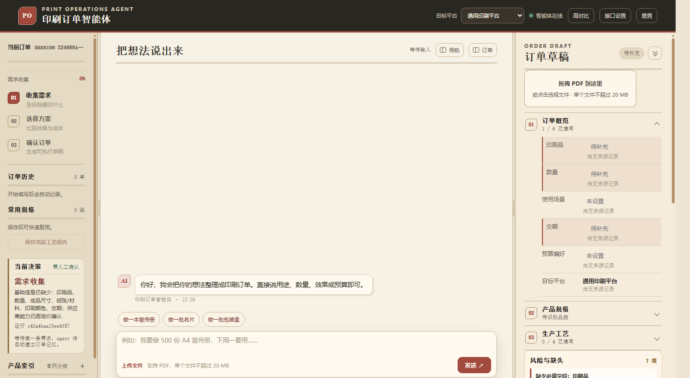
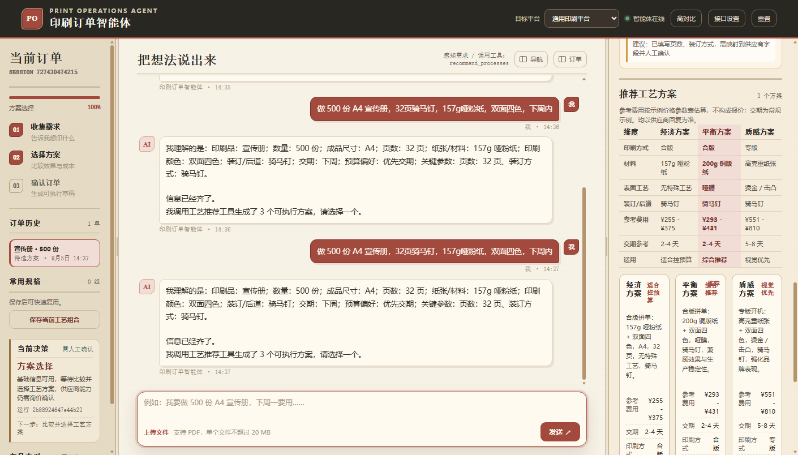
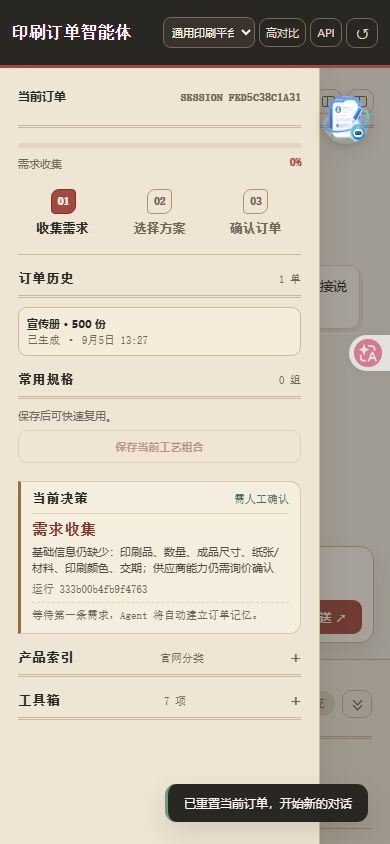

<div align="center">

# PrintOps 印刷订单智能体

**把一句“我想印 500 份宣传册”，变成一张完整、可询价、可交接的印刷订单**

[简体中文](README.md) · [English](README.en.md)

[](https://github.com/11122313211/PrintOps/actions/workflows/ci.yml)
[](LICENSE)


**零第三方依赖 · 本地优先 · 数据不出本机 · 人工确认后才交接**



</div>

---

PrintOps 是一个面向市场、设计和采购团队的本地印刷订单 Agent。用户只需要描述“要印什么、用于什么场景”，系统就会逐步补齐印刷品类所需参数，解释工艺取舍，生成三档可比的工艺方案（含参考费用与交期），最终产出一张**字段可溯源、经人工确认**的订单交接单。

> 定位：订单**前置整理与沟通**工具。它不自动下单、不替代印前检查、不承诺真实报价——所有对外动作都停在“人工确认”这道闸门之前。

**北极星目标**：让非印刷专业用户在 10 分钟内把模糊需求整理成完整、可靠、可追溯的印刷订单。

## ✨ 功能特性

**从一句话到一张订单**
- 🗣️ 自然语言识别：品类、数量、尺寸、纸张、颜色、工艺、装订、交期、预算；支持修改与否定（“数量改成 1200 张”“不要覆膜”）
- 📐 四种尺寸语义分轨：成品尺寸 / 展开尺寸 / 刀模尺寸 / 包装三维尺寸，带标签的输入按语义落位，包装盒支持内尺寸/外尺寸
- 🧩 多产品订单：每件产品独立 `itemId`、独立参数与方案状态，互不串项

**专业规则前置（可解释、带版本）**
- 🏭 合版 / 专版：方案默认印刷方式、批次色差与专色限制、专版溢价系数
- 💰 参考费用：示例价格参数表（品类基数 × 数量阶跃 × 工艺系数 × 印刷方式系数，带版本号），“不构成报价”
- 📏 起印量提示、开数参考（大度/正度整裁与利用率）、骑马钉页数约束等行业规则
- 🧾 品类专属参数：16 个品类目录（名片、标签、包装盒、手提袋、纸杯、喷画……），按品类追问关键参数

**可解释、可确认**
- 🔍 字段溯源：每个字段记录来源（用户/规则/模型）与置信度；低置信度的生产字段必须人工确认才能生成交接单
- 🧭 运行轨迹：每次运行的步骤事件（感知 → 规划 → 工具）可回查，知识版本可追溯
- ✋ 人工确认闸门：交接单与询价请求必须显式确认，绝不自动提交供应商

**文件与导出**
- 📄 浏览器本地 PDF 基础预检（页数、页面框、颜色空间线索、字体嵌入线索），原稿不上传
- 📦 交接单文本 + JSON / CSV / Markdown 导出

## 🖼️ 界面预览

| 方案对比 | 移动端（390px） |
| --- | --- |
|  |  |

## 🚀 快速开始

环境要求：**Python 3.9+**，无任何第三方依赖。

```bash
git clone https://github.com/11122313211/PrintOps.git
cd PrintOps
python server.py          # macOS / Linux；Windows 双击 start_windows.bat
```

打开 <http://localhost:4174/>，健康检查：<http://localhost:4174/api/health> → `{"ok": true}`

> 🔐 首次启动时，终端会打印**本地访问令牌**（`X-PrintOps-Token`）。页面会自动携带；用 curl 调试时请加 `-H "X-PrintOps-Token: <令牌>"`。

<details>
<summary><b>端口冲突排查</b></summary>

默认端口被占用时，先确认占用者，不要直接切换端口：

```bash
# macOS / Linux
lsof -nP -iTCP:4174 -sTCP:LISTEN
# Windows PowerShell
Get-NetTCPConnection -LocalPort 4174 -State Listen
```

开发排障可临时用环境变量覆盖端口，但提交与验收统一使用 `4174`：`PRINTOPS_PORT=4174 python3 server.py`

</details>

## 💬 使用示例

| 你说 | 系统做 |
| --- | --- |
| 做 500 份 A4 宣传册，32页骑马钉，157g哑粉纸，双面四色，下周内 | 建单 → 生成三档方案（印刷方式 / 参考费用 / 交期横向对比）→ 等你选择 |
| 做一批 5×5cm 圆形透明不干胶标签 | 识别小尺寸与标签面材/形状，追问胶水与使用场景 |
| 做 500 个天地盖包装盒，60*40*20cm，内尺寸 | 识别盒型结构与三维尺寸，按内尺寸语义落位（糊盒刀模以内尺寸为准） |
| 数量改成 1200，不要覆膜 | 修改订单并使旧方案失效，重新推荐 |

方案选择区提供**横向对比表**（印刷方式 / 材料 / 表面工艺 / 装订 / 参考费用 / 交期参考 / 适用），综合推荐列高亮；参考费用按带版本的示例价格参数表估算，不构成报价。


## 🧠 工作方式

```
需求理解 → 品类澄清 → 参数补全 → 工艺推荐 → 文件预检
       → 报价准备 → 人工确认 → 平台交接 / 导出
```

**分工原则：模型负责理解与解释，规则负责约束，工具负责执行，人负责确认高风险结果。**

| 模块 | 职责 |
| --- | --- |
| `nlu.py` | 规则感知：字段抽取与置信度分级（显式证据 ≥0.9，弱推断 <0.75 需确认） |
| `order_model.py` | 订单数据契约、数量/尺寸规范化、`schemaVersion` 迁移 |
| `tools.py` | 白名单工具：工艺推荐、估价、供应商能力匹配、交接单、询价准备 |
| `agent.py` | 会话记忆（SQLite WAL）、工作流阶段机、工具网关、模型协作（最多两轮） |
| `llm_adapter.py` | OpenAI 兼容规划器（可选），失败自动回退规则；内置 SSRF 主机校验 |
| `product_knowledge.py` | 品类目录、印刷知识、示例价格参数表（均带版本与来源） |
| `supplier_adapters.py` | 平台能力档案与按品类分层的字段映射协议 |

完整设计见 [架构与数据契约](docs/ARCHITECTURE.md)。

## 🔐 安全模型

- **本地访问令牌**：除 `/api/health` 外，全部接口要求 `X-PrintOps-Token`（服务启动时生成进程内随机令牌并注入所服务的页面）；跨来源请求返回 403
- **静态白名单**：仅放行 `/`、`/index.html`、`/app.js`、`/styles.css`；源码、文档与运行时数据一律 404
- **SSRF 防护**：模型接口 URL 在配置时校验主机，拒绝环回 / 私有 / CGNAT / 保留 / 链路本地地址
- **API Key**：仅保存在本机 `data/llm_config.json`（权限 600），不进日志、导出与 Git；明文存储时界面提示风险，更安全的做法是仅用环境变量提供
- **数据 durability**：SQLite 启用 WAL 与 5s busy_timeout；损坏会话自动隔离（备份至 `data/corrupted/`）后继续服务

已知限制与后续加固项见 [ROADMAP 系统优化路线图](docs/ROADMAP.md)。

## 🧪 测试与质量

```bash
python -m unittest discover -s tests -p "test_*.py"   # 149 个单元 / 契约 / 安全边界测试
python tests/evaluate_agent.py                        # 111 例脱敏订单评测 + 真实语料评测
python tools/secret_scan.py                           # 敏感信息扫描
```

发布门槛：字段准确率 ≥95%、可完成用例完整率 ≥80%（当前均为 100%）；真实脱敏语料达 20 例后启用硬门槛。CI 在 Ubuntu/Windows × Python 3.9/3.12 上执行以上全部检查。

1.0 发布门槛与真人走查清单见 [RELEASE_CHECKLIST](docs/RELEASE_CHECKLIST.md)。

## 🗺️ 路线图

- **v1.0（当前）**：首个稳定版——自然语言建单、可解释方案、本地安全模型、受控导出
- **v1.1+**：受控供应商接入（能力档案 + 字段适配器 → 报价草稿 → 人工确认后提交）、真实报价回写、生产交期倒排
- 持续：评测集真实语料替换、行业规则库扩充、LLM 锁与会话隔离优化

详见 [ROADMAP](docs/ROADMAP.md)。

## 📖 文档

| 文档 | 内容 |
| --- | --- |
| [架构与数据契约](docs/ARCHITECTURE.md) | 模块职责、字段契约、置信度与迁移策略 |
| [路线图](docs/ROADMAP.md) | 版本里程碑、系统优化路线图 |
| [1.0 发布门槛与验收清单](docs/RELEASE_CHECKLIST.md) | 发布门槛、真实语料与真人走查 |
| [开源选型参考](docs/OPEN_SOURCE_OPTIONS.md) | 后续可引入的组件选型 |

## 🤝 贡献

欢迎 Issue 与 PR。提交前请运行：

```bash
python -m unittest discover -s tests -p "test_*.py"
python tests/evaluate_agent.py
python tools/secret_scan.py
```

## 📄 许可证

[MIT](LICENSE) © PrintOps contributors

## 🙈 致谢

品类目录与参数结构参考盛大印刷公开产品导航（[sd2000.com](https://www.sd2000.com/)）等公开信息整理，仅用于参数口径对齐，不代表任何供应商的实时价格、产能或交期。
